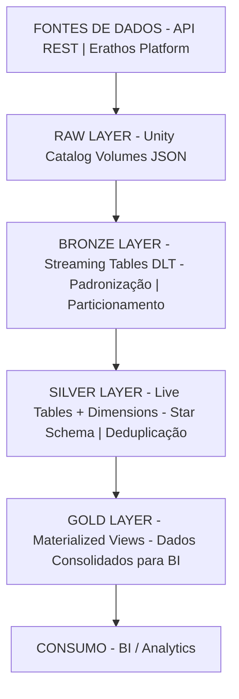

# Pipeline de Dados Financeiros | Databricks Data Lakehouse

## 📋 Contexto do Projeto

Desenvolvimento de pipeline de dados financeiros para consolidação e análise de informações contábeis provenientes de múltiplas fontes (Erathos e API REST), com foco em governança, qualidade e performance.

## 🎯 Desafio de Negócio

A organização necessitava de uma solução robusta para:

- Centralizar dados financeiros dispersos em diferentes sistemas
- Garantir qualidade e consistência dos dados contábeis
- Prover acesso governado e auditável às informações
- Reduzir tempo de processamento e disponibilização de dados
- Facilitar análises de DFC, DRE, FCP e Saldos Bancários

## 💼 Solução Implementada

### Arquitetura Técnica

Pipeline de dados baseado em **arquitetura medalhão** (Medallion Architecture) implementado na plataforma **Databricks**, utilizando **Delta Live Tables** para orquestração declarativa e **Unity Catalog** para governança centralizada.

### Camadas de Dados

#### **RAW Layer**
- Ingestão de dados via API REST e plataforma Erathos
- Armazenamento em Unity Catalog Volumes (formato JSON)
- Preservação de dados originais com metadados de rastreabilidade

#### **Bronze Layer**
- Streaming Tables para processamento contínuo e incremental
- Padronização de schemas e tipos de dados
- Particionamento por período (ano_mes) para otimização de queries
- Metadados de origem e timestamps de processamento

#### **Silver Layer**
- Live Tables com regras de negócio aplicadas
- Modelagem dimensional (Star Schema) com hierarquias de planos de contas
- Deduplicação e normalização de dados
- Enriquecimento com tabelas dimensionais

#### **Gold Layer**
- Materialized Views para consumo analítico
- Dados consolidados e prontos para ferramentas de BI
- Performance otimizada para análises de negócio

## 🛠️ Stack Tecnológico

**Plataforma:** Databricks Data Lakehouse  
**Storage:** Delta Lake (ACID transactions)  
**Orquestração:** Delta Live Tables (DLT)  
**Governança:** Unity Catalog  
**Processamento:** Apache Spark (Spark SQL, Structured Streaming)  
**Linguagens:** SQL, PySpark  

## 📊 Entregáveis

### Tabelas Fato
- **fact_dfc** - Demonstração de Fluxo de Caixa
- **fact_dre** - Demonstração do Resultado do Exercício
- **fact_fcp** - Fluxo de Contas a Pagar/Receber consolidado
- **fact_saldo** - Posição diária de Saldos Bancários

### Tabelas Dimensão
- **dim_planos_dfc/dre/fcp** - Hierarquias de planos de contas (3 níveis)
- **dim_centro_custo_dre** - Centros de custo organizacionais
- **dim_normalizacao_descricao** - Padronização de descrições

### Componentes de Ingestão
- Notebooks parametrizados para extração via API REST
- Integração com plataforma Erathos
- Scripts de setup e manutenção (Unity Catalog, limpeza de volumes)

## 🔧 Recursos Técnicos Implementados

### Performance
```sql
-- Otimização automática habilitada
'delta.autoOptimize.optimizeWrite' = 'true'
'delta.autoOptimize.autoCompact' = 'true'

-- Particionamento estratégico
PARTITIONED BY (ano_mes)
```

### Governança & Auditoria

- Unity Catalog com controle de acesso por catálogo/schema
- Change Data Feed (CDF) para rastreamento de alterações
- Time Travel com retenção de 30 dias (logs) e 7 dias (arquivos)
- Metadados completos de origem e processamento

### Qualidade de Dados

- Deduplicação via `QUALIFY ROW_NUMBER()` com ordenação por timestamp
- Normalização de descrições através de tabela de mapeamento
- Padronização de campos texto (UPPER, TRIM)
- Conversão e validação de tipos de dados

### Processamento Incremental

```sql
-- Streaming Tables para ingestão contínua
CREATE OR REFRESH STREAMING TABLE bronze.fact_saldo
FROM STREAM read_files('/Volumes/bitz/raw/saldo', format => 'json')
```

## 📐 Arquitetura de Dados



## 📂 Estrutura do Repositório

```
pipeline-bitz/
├── ingestao/                    # Módulos de ingestão
│   ├── get_saldo.ipynb           # Extração de saldos via API
│   ├── get_pagar_receber.ipynb   # Extração contas pagar/receber
│   ├── table_dfc_nivel_0.ipynb   # Processamento DFC (Erathos)
│   ├── table_dre_nivel_0.ipynb   # Processamento DRE (Erathos)
│   ├── table_fcp_nivel_0.ipynb   # Processamento FCP (Erathos)
│   └── table_dfc_intermediario.ipynb
│
├── pipeline/                    # Delta Live Tables (DLT)
│   ├── bronze/                   # Camada Bronze
│   │   ├── fact_saldo.sql
│   │   ├── fact_contas_pagar_fcp.sql
│   │   └── fact_contas_receber_fcp.sql
│   │
│   ├── silver/                   # Camada Silver
│   │   ├── fact_dfc.sql
│   │   ├── fact_dre.sql
│   │   ├── fact_saldo.sql
│   │   ├── fact_contas_pagar_fcp.sql
│   │   ├── fact_contas_receber_fcp.sql
│   │   ├── dim_planos_dfc.sql
│   │   ├── dim_planos_dre.sql
│   │   └── dim_planos_fcp.sql
│   │
│   └── gold/                    # Camada Gold
│       ├── fact_dfc.sql
│       ├── fact_dre.sql
│       ├── fact_fcp.sql
│       └── dim_centro_custo_dre.sql
│
└── utils/                    # Scripts utilitários
    ├── create_catalog_schema.py  # Setup Unity Catalog
    ├── normalizacao_descricao.ipynb
    └── limpeza_volume.ipynb
```

## 🚀 Implementação

### 1. Setup Inicial

```python
# Criação do catálogo e schemas no Unity Catalog
%run ./utils/create_catalog_schema.py
```

### 2. Configuração do Pipeline DLT

- **Source Code:** Diretório `pipeline/`
- **Target Catalog:** `bitz`
- **Pipeline Mode:** Triggered/Continuous
- **Configurações:** Auto-optimize habilitado

### 3. Execução

1. Notebooks de ingestão (camada RAW)
2. Pipeline DLT (Bronze → Silver → Gold)
3. Scripts de manutenção (conforme necessário)

## 📈 Resultados e Benefícios

### Técnicos

- ✅ Pipeline totalmente automatizado e gerenciado via DLT
- ✅ Processamento incremental com Streaming Tables
- ✅ Governança centralizada com Unity Catalog
- ✅ Rastreabilidade completa (lineage) dos dados
- ✅ Qualidade garantida via deduplicação e normalização

### Negócio

- ✅ Consolidação de dados financeiros de múltiplas fontes
- ✅ Redução significativa no tempo de disponibilização de dados
- ✅ Acesso governado e auditável às informações
- ✅ Base sólida para análises financeiras e tomada de decisão

## 🎓 Competências Técnicas Demonstradas

**Data Engineering:**

- Arquitetura Medalhão (Medallion Architecture)
- Modelagem Dimensional (Star Schema)
- Processamento Incremental e Streaming
- ETL/ELT Patterns
- Data Quality & Governance

**Databricks Platform:**

- Delta Lake (ACID, Time Travel, CDF)
- Delta Live Tables (Declarative Pipelines)
- Unity Catalog (Governance)
- Structured Streaming
- Auto Loader

**Apache Spark:**

- Spark SQL (transformações declarativas)
- PySpark (ingestão e processamento)
- Otimização de queries e particionamento

## 🔗 Tecnologias

`Databricks` `Delta Lake` `Delta Live Tables` `Unity Catalog` `Apache Spark` `PySpark` `Spark SQL` `Data Engineering` `ETL/ELT` `Data Lakehouse` `Medallion Architecture` `Streaming` `Data Governance` `Dimensional Modeling` `Star Schema`

---

**Projeto desenvolvido seguindo as melhores práticas de engenharia de dados moderna, com foco em escalabilidade, governança e qualidade.**
